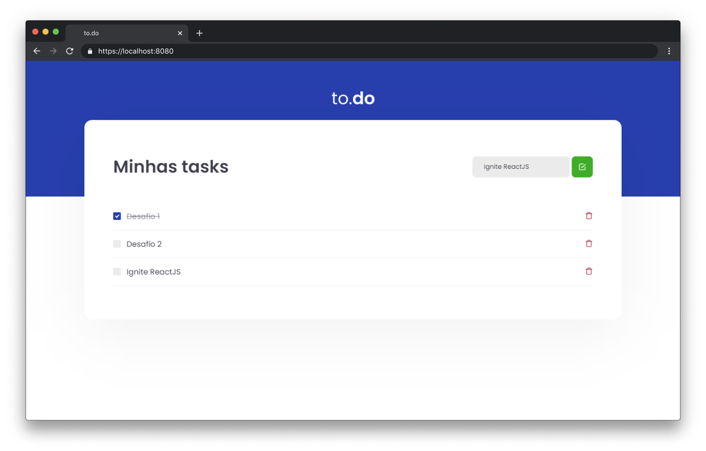

<p align="center">
  
</p>

## 🧪 Tecnologias

Esse projeto foi desenvolvido com as seguintes tecnologias:

- TypeScript
- ReactJS

## 🚀 Uso

```bash 
git clone https://github.com/gutemberg-jhonata/to.do.git
cd to.do
yarn dev
```

## 💻 Projeto

O to.do foi um desafio realizado durante o bootcamp Ignite, na trilha ReactJS. Trata-se de uma aplicação simples de lista de tarefas.

## :memo: Licença

Esse projeto está sob a licença MIT. Veja o arquivo [LICENSE](.github/LICENSE.md) para mais detalhes.